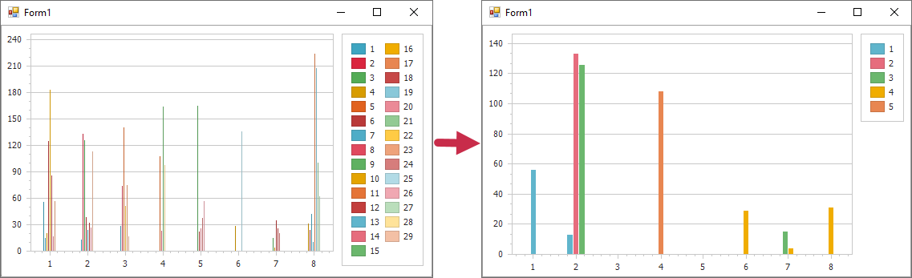

<!-- default badges list -->

<!-- default badges end -->
# Charts for WinForms - How to Hide Specific Series

This example demonstrates how to handle the [ChartControl.BoundDataChanged](https://docs.devexpress.com/WindowsForms/DevExpress.XtraCharts.ChartControl.BoundDataChanged) event to conditionally hide automatically created series. The Chart hides all series whose number is less than 5: 

## Files to Review

[Form1.cs](./CS/WindowsApplication1/WindowsApplication1/Form1.cs) / [Form1.vb](./VB/WindowsApplication1/WindowsApplication1/Form1.vb)

<!-- feedback -->
## Does this example address your development requirements/objectives?

 

(you will be redirected to DevExpress.com to submit your response)
<!-- feedback end -->
